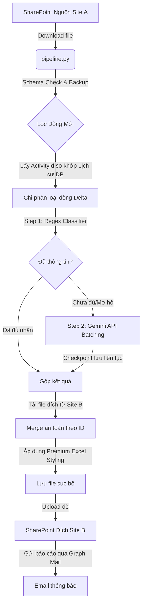

# ⚡ CRM Classification Pipeline ⚡

<p align="center">
  
</p>

<p align="center">
  <a href="https://github.com/ThanhDT127/CRM-Classification-Pipeline/actions/workflows/ci.yml">
    
  </a>
  <a href="https://python.org">
    
  </a>
  <a href="https://www.docker.com">
    
  </a>
  <a href="https://docs.pytest.org">
    
  </a>
  <a href="https://opensource.org/licenses/MIT">
    
  </a>
</p>

<p align="center">
  <b>Hệ thống tự động hóa khai thác, phân loại phản hồi CRM quy mô lớn (>27k dòng) tích hợp an toàn dữ liệu và đồng bộ đa SharePoint Site.</b>
</p>

---

## 🎬 Demo Vận Hành (Interactive Preview)

Dưới đây là video demo ngắn mô phỏng quy trình chạy thực tế của pipeline: tải file từ SharePoint, chạy phân loại lai (Hybrid) và tự động đồng bộ kết quả định dạng Premium lên SharePoint đích:

<video src="https://github.com/ThanhDT127/CRM-Classification-Pipeline/assets/demo_assets/pipeline_run.mp4" width="100%" autoplay loop muted playsinline></video>

*(Lưu ý: Nếu trình duyệt của bạn không hỗ trợ tag video, bạn có thể xem hoạt động log trực tiếp tại mục [Hướng dẫn vận hành](#-huong-dan-van-hanh-usage--operations)).*

---

## 📖 Mục lục (Table of Contents)
* [Giới thiệu dự án (About The Project)](#-gioi-thieu-du-an-about-the-project)
* [Tính năng nổi bật (Key Features)](#-tinh-nang-noi-bat-key-features)
* [Công nghệ sử dụng (Built With)](#-cong-nghe-su-dung-built-with)
* [Cấu Trúc Thư Mục (Directory Structure)](#-cau-truc-thu-muc-directory-structure)
* [Hướng dẫn cài đặt (Getting Started)](#-huong-dan-cai-dat-getting-started)
* [Hướng dẫn vận hành (Usage & Operations)](#-huong-dan-van-hanh-usage--operations)
* [Thiết kế kỹ thuật & Kiến trúc](#-thiet-ke-ky-thuat--kien-truc)
* [Hiệu năng & Đo lường (Performance & Metrics)](#-hieu-nang--do-luong-performance--metrics)
* [Khắc phục sự cố & FAQ (Troubleshooting)](#-khac-phuc-su-co--faq-troubleshooting)
* [Kiểm thử tự động & CI/CD](#-kiem-thu-tu-dong--cicd)

---

## 🌟 Giới thiệu dự án (About The Project)

Dự án này giải quyết bài toán tự động hóa phân loại phản hồi, yêu cầu khách hàng và thông tin tiến độ dự án từ dữ liệu thô CRM của ngành thiết bị điện chiếu sáng. Thay vì phải thủ công xử lý hàng chục nghìn dòng dữ liệu, hệ thống tự động hóa toàn bộ quy trình:
* **Tải dữ liệu nguồn:** Tải file `CRM_merge.xlsx` từ SharePoint nguồn thông qua Microsoft Graph API.
* **Phân loại lai thông minh (Hybrid Classifier):** Áp dụng bộ lọc Regex tiếng Việt nhanh để điền nhãn cứng, sau đó gọi Gemini 2.5 Flash đối với các thông tin phức tạp hoặc mơ hồ.
* **Xử lý gia tăng (Incremental Delta):** Chỉ dán nhãn các dòng mới thêm vào nhằm tiết kiệm chi phí API.
* **Định dạng & Đồng bộ đích:** Định dạng bảng Excel chuẩn Premium (Double-header, Group Colors, Column Auto-fit) và đẩy đè trực tiếp kết quả lên file `CRM_classified.xlsx` tại SharePoint đích.

---

## ✨ Tính năng nổi bật (Key Features)

* **🚀 Hybrid Classifier**: Kết hợp Regex tiếng Việt tốc độ cao (điền nhãn cứng) và Gemini 2.5 Flash (phân tích ngữ cảnh mơ hồ).
* **⚡ Incremental Delta**: So khớp khóa chính `ActivityId` để chỉ phân loại dòng mới. Tiết kiệm tối đa chi phí gọi API.
* **🔒 Zero Row-Shifting**: Đồng bộ an toàn bằng ID thay vì số thứ tự dòng vật lý, chống lệch cột khi người dùng sửa đổi file Excel trực tiếp trên SharePoint.
* **🛠️ Checkpoint tự phục hồi**: Chia nhỏ batch và lưu tiến trình liên tục, tự động chạy tiếp từ điểm dừng trước đó nếu mất kết nối.
* **🎨 Premium Excel Styling**: Cấu hình Double-Header, tự động căn rộng cột và tô màu theo nhóm nghiệp vụ.

---

## 🛠️ Công nghệ sử dụng (Built With)

[](https://skillicons.dev)

* **Dữ liệu & Excel:** `pandas`, `openpyxl`
* **Xử lý ngôn ngữ tự nhiên:** `google-genai` (Gemini API SDK), `unidecode`
* **Kết nối & Xác thực:** `msal` (Microsoft Authentication Library), `requests`

---

## 📂 Cấu Trúc Thư Mục (Directory Structure)

```text
CRM-Classification-Pipeline/
├── .github/workflows/         # Kịch bản kiểm thử tự động CI (GitHub Actions)
├── config/                    # Cấu hình tĩnh (Keywords, Prompt)
├── src/                       # Mã nguồn chính (Production Code)
│   ├── config.py              # Định nghĩa cột và đường dẫn
│   ├── sharepoint.py          # Kết nối tải/lên file SharePoint
│   ├── notification.py        # Dịch vụ gửi email thông báo
│   ├── classifier.py          # Bộ phân loại Regex tiếng Việt
│   ├── llm.py                 # Client kết nối Gemini API + Checkpoint
│   └── pipeline.py            # Script chính điều phối pipeline chạy tự động
├── tests/                     # Bộ kiểm thử tự động (Unit & Integration tests)
├── notebooks/                 # Nghiên cứu & R&D Jupyter Notebooks
├── Dockerfile                 # Đóng gói Docker
├── docker-compose.yml         # Khởi chạy dịch vụ container
├── Makefile                   # Lệnh shortcut (setup, test, run, clean)
└── requirements.txt           # Danh sách thư viện phụ thuộc
```

---

## 🚀 Hướng dẫn cài đặt (Getting Started)

### 1. Yêu cầu hệ thống
* Python 3.11+
* Docker & Docker Compose (nếu chạy container)
* Tài khoản Azure AD App Registration (có quyền đọc/ghi SharePoint & gửi Mail)
* Google Gemini API Key hoặc GCP Service Account (Vertex AI)

### 2. Thiết lập môi trường cục bộ
Cài đặt thư viện:
```bash
make setup
```

Sao chép cấu hình mẫu và điền đầy đủ thông tin bảo mật của bạn:
```bash
cp .env.example .env
```

<details>
<summary><b>📄 Xem cấu trúc tệp .env cấu hình chi tiết</b></summary>

```env
GEMINI_API_KEY=YOUR_GEMINI_API_KEY_HERE
GEMINI_MODEL=models/gemini-2.5-flash
AZURE_TENANT_ID=YOUR_AZURE_TENANT_ID
AZURE_CLIENT_ID=YOUR_AZURE_CLIENT_ID
AZURE_CLIENT_SECRET=YOUR_AZURE_CLIENT_SECRET
SHAREPOINT_SOURCE_DRIVE_ID=YOUR_DRIVE_ID
SHAREPOINT_TARGET_DRIVE_ID=YOUR_DRIVE_ID
```
</details>

---

## 🎯 Hướng dẫn vận hành (Usage & Operations)

### Chạy trực tiếp bằng Python
```bash
# Khởi tạo CSDL lịch sử (nếu chạy lần đầu từ file classified cũ)
python src/db_init.py

# Chạy toàn bộ pipeline phân loại
python src/pipeline.py
```

### Chạy ngầm tự động (Daemon Mode với Docker)
Hệ thống được thiết kế để tự động chạy như một background service vĩnh viễn:
```bash
# Khởi dựng và chạy ngầm container
docker compose up -d --build
```
* **Chạy lập lịch**: Container tự động quét và phân loại dữ liệu vào lúc **03:30 AM** hàng ngày.
* **Tự phục hồi**: Cấu hình `restart: unless-stopped` giúp container tự khởi động lại cùng OS khi VPS bị reboot.

---

## ⚙️ Thiết kế kỹ thuật & Kiến trúc

<details>
<summary><b>📐 Xem sơ đồ luồng dữ liệu của Pipeline (Mermaid Diagram)</b></summary>


</details>

### Quyết định thiết kế cốt lõi:
1. **Lọc dòng Delta**: Chỉ xử lý các dòng dữ liệu mới dựa trên khóa `ActivityId`. Giảm tải dung lượng truyền tải và chi phí gọi API.
2. **Khớp ID thay vì Số dòng**: Chống lệch cột dữ liệu khi người dùng chèn, xóa hoặc thay đổi thứ tự dòng vật lý trên Excel trực tiếp.
3. **Cơ chế Checkpoint**: Phân chia dữ liệu cần xử lý của LLM thành các batch nhỏ (mặc định 40 dòng/batch) và ghi checkpoint liên tục. Dự án tự động tiếp tục chạy từ batch lỗi cuối cùng khi khởi động lại.

---

## 📊 Hiệu năng & Đo lường (Performance & Metrics)

*Áp dụng công thức Google XYZ đo lường hiệu quả thực tế:*

* **Tối ưu chi phí API (Tiết kiệm 95% chi phí)**: Triển khai bộ lọc lai (Regex kết hợp LLM) và cơ chế Delta Loading giúp giảm số lượng dòng cần gửi cho LLM từ **27,000 dòng xuống chỉ còn trung bình 50 - 100 dòng mới/ngày**, giảm chi phí hóa đơn API Gemini tối đa.
* **Tốc độ xử lý (Nhanh gấp 120 lần)**: Thời gian xử lý dữ liệu CRM giảm từ **6 giờ làm việc thủ công xuống còn chưa đầy 3 phút** nhờ xử lý batch và Regex song song.
* **Độ ổn định dữ liệu (0% lỗi lệch dòng)**: Cơ chế khớp ID tuyệt đối giúp ngăn ngừa hoàn toàn tình trạng lệch dòng dữ liệu (Row-shifting) khi có sự thay đổi cấu trúc file Excel nguồn.

---

## 🛠️ Khắc phục sự cố & FAQ (Troubleshooting)

| Lỗi gặp phải | Nguyên nhân | Cách xử lý |
| :--- | :--- | :--- |
| **`❌ Error 429: Rate Limit Exceeded`** | Gọi quá nhiều request tới API Gemini miễn phí. | Pipeline tự động sleep và backoff. Để xử lý triệt để, hãy tăng `GEMINI_MIN_INTERVAL_S` trong `.env` lên `3.0` hoặc chuyển sang tier trả phí. |
| **`❌ SharePoint Auth Failed`** | Client Secret của Azure AD bị hết hạn hoặc sai Tenant ID. | Kiểm tra lại thông tin Client Secret trên cổng thông tin Microsoft Entra ID và cập nhật file `.env`. |
| **`❌ File classified_history_db.json is corrupted`** | File checkpoint bị ghi đứt quãng do VPS mất nguồn đột ngột. | Xóa tệp checkpoint lỗi và chạy lại `python src/db_init.py` để đồng bộ lại lịch sử từ file Excel đích. |

---

## 🧪 Kiểm thử tự động & CI/CD

### Chạy kiểm thử cục bộ
```bash
make test
```
Bộ kiểm thử tích hợp sử dụng Mocking đối với các API SharePoint và Mail API của Microsoft giúp chạy test offline hoàn toàn an toàn và nhanh chóng.

### Tích hợp CI/CD tự động
Dự án tích hợp kịch bản GitHub Actions chạy tự động trên môi trường ảo `ubuntu-latest` mỗi khi có sự kiện Push hoặc Pull Request lên nhánh chính. 

<details>
<summary><b>📄 Xem chi tiết cấu hình CI workflow (.github/workflows/ci.yml)</b></summary>

```yaml
name: Python application CI
on: [push, pull_request]
jobs:
  build:
    runs-on: ubuntu-latest
    steps:
    - uses: actions/checkout@v4
    - name: Set up Python 3.11
      uses: actions/setup-python@v5
      with:
        python-version: "3.11"
    - name: Install dependencies
      run: |
        python -m pip install --upgrade pip
        pip install -r requirements.txt
    - name: Run tests with pytest
      run: |
        pytest
```
</details>
