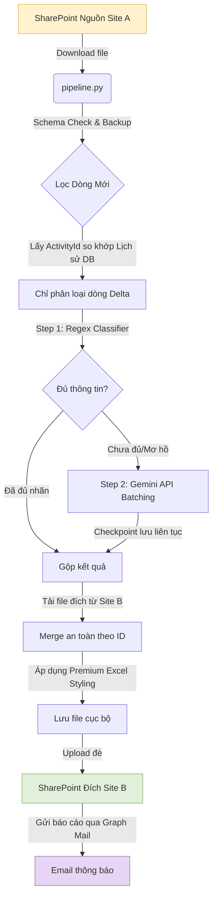

<h1 align="center">⚡ CRM Classification Pipeline ⚡</h1>

<p align="center">
  <a href="https://github.com/ThanhDT127/CRM-Classification-Pipeline/actions/workflows/ci.yml">
    
  </a>
  <a href="https://python.org">
    
  </a>
  <a href="https://www.docker.com">
    
  </a>
  <a href="https://docs.pytest.org">
    
  </a>
</p>

<p align="center">
  <b>Hệ thống tự động hóa khai thác, phân loại dữ liệu phản hồi CRM quy mô lớn (>27k dòng) tích hợp an toàn dữ liệu và đồng bộ đa SharePoint Site.</b>
</p>

<br />

---

## 📝 Mục lục (Table of Contents)

1. [Giới thiệu dự án (About The Project)](#about-the-project)
2. [Tính năng nổi bật (Key Features)](#key-features)
3. [Công nghệ sử dụng (Built With)](#built-with)
4. [Cấu Trúc Thư Mục (Directory Structure)](#directory-structure)
5. [Hướng dẫn cài đặt (Getting Started)](#getting-started)
6. [Hướng dẫn vận hành (Usage & Operations)](#usage)
7. [Thiết kế kỹ thuật (Technical Design)](#technical-design)
8. [Kiểm thử tự động & CI/CD (Testing & CI-CD)](#testing-cicd)

---

## <a name="about-the-project"></a>🌟 Giới thiệu dự án (About The Project)

Dự án này giải quyết bài toán tự động hóa phân loại phản hồi, yêu cầu khách hàng và thông tin tiến độ dự án từ dữ liệu thô CRM của ngành thiết bị điện chiếu sáng. Thay vì dán nhãn thủ công hàng chục nghìn dòng dữ liệu, hệ thống tự động:
* **Tải dữ liệu nguồn:** Đọc file `CRM_merge.xlsx` từ SharePoint nguồn (Site `CRM-CTDA`) thông qua Microsoft Graph API.
* **Phân loại lai thông minh (Hybrid Classifier):** Áp dụng bộ lọc Regex tiếng Việt nhanh để điền nhãn cứng, sau đó sử dụng Gemini 2.5 Flash đối với các thông tin phức tạp hoặc mơ hồ.
* **Xử lý gia tăng (Incremental Delta):** Chỉ lọc và dán nhãn những dòng mới được thêm vào (`ActivityId` chưa tồn tại trong lịch sử) nhằm tiết kiệm tối đa chi phí API.
* **Định dạng & Đồng bộ đích:** Định dạng bảng Excel chuẩn Premium (Double-header, Group Colors, Column Auto-fit) và đẩy đè trực tiếp kết quả lên file `CRM_classified.xlsx` tại SharePoint đích (Site `DataPBI_salein`).
* **Báo cáo tự động:** Gửi mail báo cáo tiến trình (hoặc báo lỗi kèm stack trace) tự động qua Graph API.

---

## <a name="key-features"></a>✨ Tính năng nổi bật (Key Features)

| Tính năng | Chi tiết giải pháp | Công nghệ sử dụng |
| :--- | :--- | :--- |
| **🚀 Hybrid Classifier** | Kết hợp bộ lọc nhanh bằng Regex tiếng Việt và Gemini 2.5 Flash xử lý các trường hợp phức tạp. | `Python`, `unidecode` |
| **⚡ Incremental Delta** | So khớp khóa chính `ActivityId` với lịch sử JSON để chỉ phân loại dòng mới. Tiết kiệm 95% chi phí API. | `pandas`, `JSON DB` |
| **🔒 Zero Row-Shifting** | Đồng bộ an toàn bằng khóa thay vì số thứ tự dòng vật lý, chống lệch cột khi người dùng sửa đổi file Excel. | `openpyxl` |
| **🛠️ Self-Healing Checkpoint** | Chia nhỏ batch và lưu tiến trình liên tục, tự động hồi phục và chạy tiếp khi lỗi Rate Limit (429). | `pipeline.py` |
| **🎨 Premium Excel Styling** | Áp dụng cấu trúc Double-Header chuyên nghiệp, tự động căn rộng và tô màu theo nhóm nghiệp vụ. | `openpyxl` |
| **📧 Direct SharePoint sync** | Tải và tải đè trực tiếp qua MS Graph API mà không cần mount ổ đĩa cục bộ trên VM. | `msal`, `requests` |

---

## <a name="built-with"></a>🛠️ Công nghệ sử dụng (Built With)

<div align="center">
  <a href="https://skillicons.dev">
    
  </a>
</div>

### Thư viện phụ thuộc chính:
* **Dữ liệu & Excel:** `pandas`, `openpyxl`
* **Xử lý ngôn ngữ tự nhiên:** `google-genai` (Gemini API SDK), `unidecode`
* **Kết nối & Xác thực:** `msal` (Microsoft Authentication Library), `requests`

---

## <a name="directory-structure"></a>📂 Cấu Trúc Thư Mục (Directory Structure)

Dự án đã được tái cấu trúc sạch sẽ ở cấp thư mục gốc (Root Level) giúp việc vận hành Docker và chạy kiểm thử cực kỳ đơn giản:

<details>
<summary><b>📂 Xem cấu trúc thư mục chi tiết (Click để mở rộng)</b></summary>

```text
CRM-Classification-Pipeline/
├── .github/workflows/         # Kịch bản kiểm thử tự động CI (GitHub Actions)
│   └── ci.yml
├── config/                    # Cấu hình tĩnh
│   ├── keywords_fixed.json    # Lưới từ khóa phân loại Regex tiếng Việt
│   └── prompt_CRM_v5.txt      # Prompt hệ thống định hướng cho Gemini
├── src/                       # MÃ NGUỒN CHÍNH (PRODUCTION)
│   ├── config.py              # Định nghĩa đường dẫn và tên 15 cột đầu ra
│   ├── sharepoint.py          # SharePoint Client (Tải/Lên file qua Microsoft Graph API)
│   ├── notification.py        # Dịch vụ gửi email thông báo thành công/lỗi
│   ├── classifier.py          # Bộ phân loại Regex tiếng Việt
│   ├── llm.py                 # Client kết nối Gemini song song với checkpoint
│   ├── pipeline.py            # Script chính điều phối toàn bộ Pipeline chạy tự động
│   └── db_init.py             # Script nén/khởi tạo cơ sở dữ liệu lịch sử từ Excel
├── tests/                     # Bộ kiểm thử tự động (Testing)
│   ├── test_pipeline.py       # Unit tests cho logic chuẩn hóa/regex
│   └── test_automation.py     # Integration tests (Mock SharePoint & Mail API)
├── notebooks/                 # Nghiên cứu & R&D Jupyter Notebooks
│   ├── CRM_Classification.ipynb
│   └── Phan_Loai_CRM_IMPROVED.ipynb
├── .dockerignore              # Tối ưu hóa dung lượng truyền vào Docker (chỉ ~1.20kB)
├── Dockerfile                 # Đóng gói Python 3.11-slim
├── docker-compose.yml         # Khởi chạy dịch vụ container
├── requirements.txt           # Danh sách các thư viện phụ thuộc
├── Makefile                   # Lệnh shortcut cho nhà phát triển
├── .env.example               # Mẫu cấu hình biến môi trường
└── README.md                  # Tài liệu hướng dẫn sử dụng
```
</details>

---

## <a name="getting-started"></a>🚀 Hướng dẫn cài đặt (Getting Started)

### 1. Yêu cầu hệ thống
* Python 3.11+
* Docker & Docker Compose (nếu chạy container)
* Tài khoản Azure AD App Registration (có quyền đọc/ghi SharePoint & gửi Mail)
* Google Gemini API Key hoặc GCP Service Account (Vertex AI)

### 2. Thiết lập môi trường cục bộ
Cài đặt dependencies:
```bash
pip install -r requirements.txt
```

Sao chép cấu hình mẫu và điền đầy đủ các thông tin bí mật:
```bash
cp .env.example .env
```
Các tham số quan trọng trong `.env`:
* `GEMINI_API_KEY`: Khóa kết nối Gemini API.
* `AZURE_TENANT_ID`, `AZURE_CLIENT_ID`, `AZURE_CLIENT_SECRET`: Thông tin xác thực Azure AD.
* `SHAREPOINT_SOURCE_DRIVE_ID` / `SHAREPOINT_TARGET_DRIVE_ID`: ID Drive của site nguồn và site đích tương ứng.

---

## <a name="usage"></a>🎯 Hướng dẫn vận hành (Usage & Operations)

### Chạy trực tiếp bằng Python
```bash
# Khởi tạo CSDL lịch sử (nếu chạy lần đầu từ file classified cũ)
python src/db_init.py

# Chạy toàn bộ pipeline phân loại
python src/pipeline.py
```

### Chạy bằng Docker (Khuyên dùng trên Máy ảo)
Việc cấu hình `.dockerignore` giúp quá trình build container cực nhẹ (chỉ gửi ~1.20kB mã nguồn):
```bash
# Khởi dựng và chạy
docker compose up --build
```

### Chạy ngầm tự động (Daemon Mode)
Hệ thống được thiết kế để tự động chạy như một background service vĩnh viễn. Khi khởi chạy qua Docker, container tự động kích hoạt chế độ Daemon (`RUN_AS_DAEMON=true`):
* **Chạy ngay lập tức:** Thực hiện quét và phân loại file trên SharePoint ngay khi khởi động container lần đầu.
* **Tự động lập lịch:** Tự động tính toán thời gian, đi vào trạng thái ngủ đông (`sleep`) và thức dậy để chạy quét delta lúc **03:30 AM** hàng ngày.
* **Tự phục hồi:** Cấu hình `restart: unless-stopped` giúp container tự động khởi động lại cùng hệ điều hành nếu máy ảo bị restart.

Để khởi chạy container chạy ngầm dưới nền:
```bash
docker compose up -d --build
```

---

## <a name="technical-design"></a>💡 Thiết kế kỹ thuật (Technical Design)



### Các quyết định thiết kế cốt lõi:
1. **Lọc dòng Delta:** Giữ file CSDL lịch sử `output/classified_history_db.json`. Chỉ gửi những dòng mới cho LLM giúp tiết kiệm **95% chi phí API** khi tệp phát sinh theo ngày.
2. **Ánh xạ khóa chính `ActivityId`:** Tuyệt đối không dùng dòng thứ tự vật lý (`row_idx`) để ghi đè kết quả. Điều này giúp chống xô lệch dữ liệu khi người dùng SharePoint chỉnh sửa cấu trúc dòng trực tiếp.
3. **Cơ chế Checkpoint tự phục hồi:** Quá trình gọi Gemini được chia nhỏ thành các batch (mặc định 40 dòng) và lưu checkpoint liên tục. Nếu xảy ra sự cố mạng, pipeline tự động chạy tiếp từ batch cuối cùng khi được khởi động lại.
4. **Premium Excel Styling:** Bảng đầu ra được định dạng chuyên nghiệp với Double-header (tiêu đề 2 dòng có gộp ô), màu sắc theo 5 nhóm nghiệp vụ chính, căn rộng tự động cho tiêu đề Segoe UI.

---

## <a name="testing-cicd"></a>🧪 Kiểm thử tự động & CI/CD (Testing & CI-CD)

### Chạy kiểm thử tự động
Dự án sử dụng `pytest` để kiểm thử logic phân loại Regex và tích hợp mock dịch vụ bên ngoài (SharePoint API, Graph Mail):
```bash
pytest -vv -s
```

### GitHub Actions CI
Mỗi lượt commit/push lên nhánh `master` hoặc `main` đều kích hoạt kịch bản kiểm tra chất lượng tự động được định nghĩa tại `.github/workflows/ci.yml`. Mã nguồn chỉ được triển khai khi vượt qua toàn bộ 7 test case thành công.
